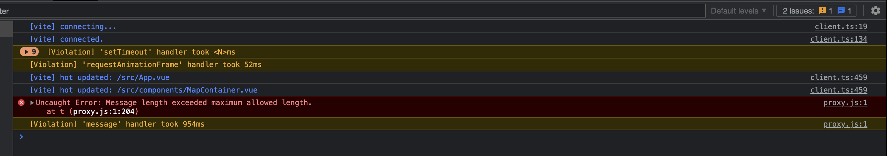

# Demo of issue with Laflet and Pinia and Vue dev tools crashing

## To run
- Clone project
- Run `yarn` to install
- Run `yarn dev` to start
- In Chrome (only browser I have to support for my client)
  - open dev tools
  - open 'Vue' devtools (install extension if needed)
  - open Pinia tab and ensure stores appear
- Click button in top left of map (send in mock object)
- Now try interacting with map (zoom and panning)
- Notice slow down

To confrm it's a DevTools issue: 

- Reload tab
- Close dev tools
- Notice how app runs fine when adding loads of markers
- App will also stay perfomant when you open dev tool but will slow down when you open the Vue tab

Looking in the console, you'll spot warnings and some errors around message length/violation and eventually when you keep clicking and adding loads more markers:

